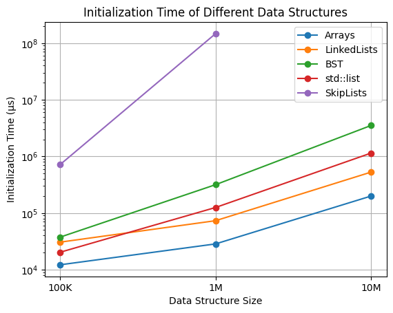
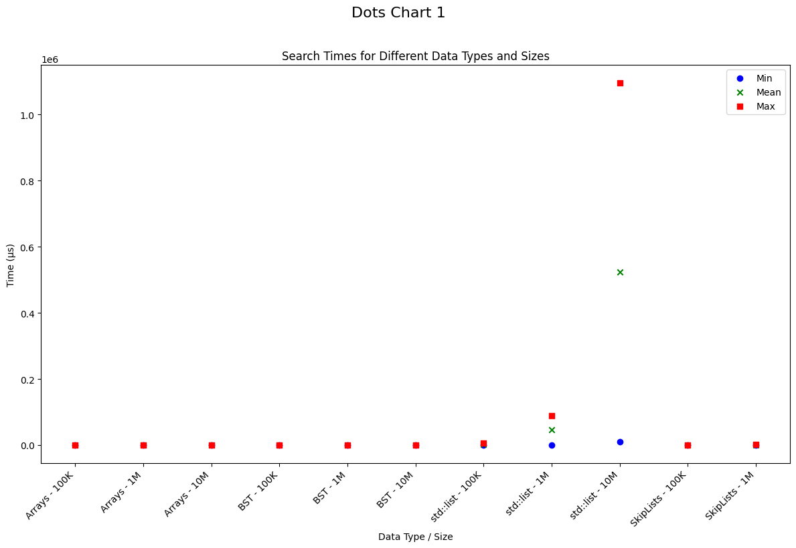
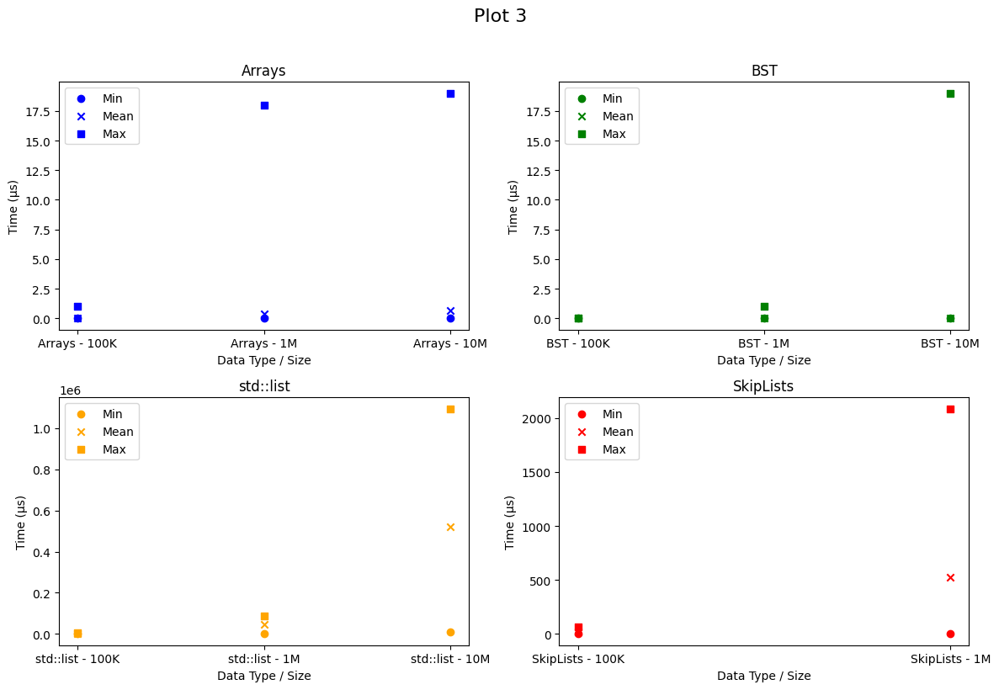
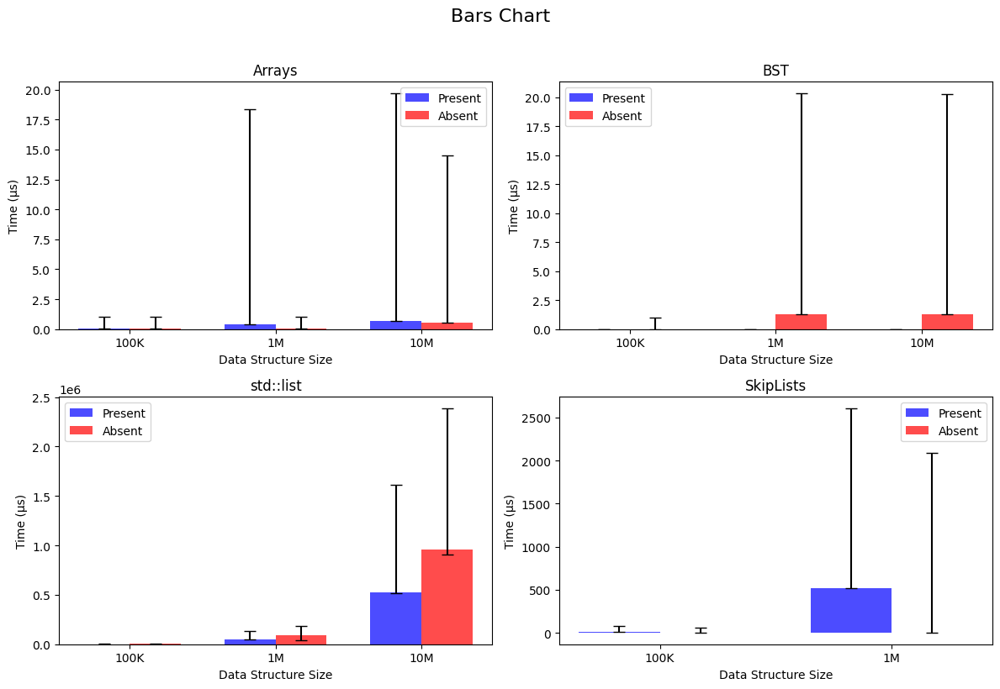
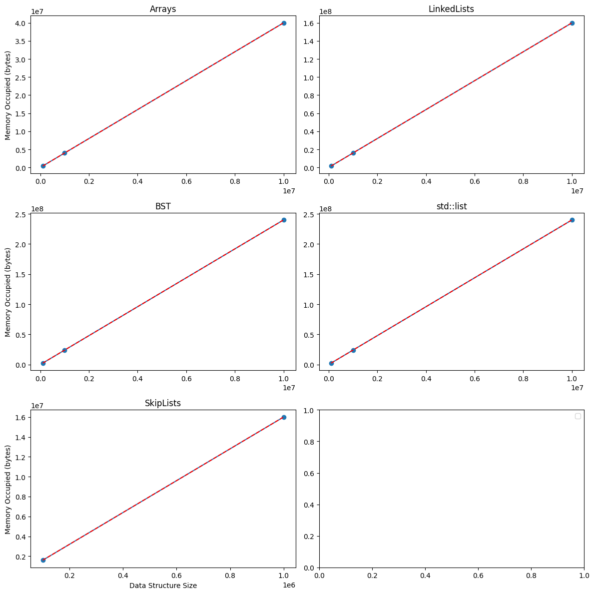

# Data Structures

## Initialization Time Analysis

1. Due to the pre-memory-allocation characteristic of the Array data type; its initialization time mostly consists of the time it takes to generate the random numbers, therefore it is the fastest data type to initialize.
2. Since the `std::list` and the custom LinkedList are both implemented as a linked-list, they have almost the same initialization time; although since the `std::list` is double linked and does a bit more work, it is slightly slower. But their growth rate is the same. Since they need to allocate memory per each new node insertion, they're slower than array.
3. The BST is implemented as a tree, and its initialization also consists of the time it takes to sort the random generated data. Therefore, it's slower than the former two.
4. The Skip-List is implemented as a linked-list with multiple layers, and its initialization time is the longest. This is because it has to sort the random generated data, and then build the layers. Therefore, it's the slowest data type to initialize. And its growth rate is also the fastest. I gave up on initializing it with 10M since it took so long without any response.

## Sort Time Analysis

> Note: Skip-List and BST are excluded since they're already sorted.

1. Due to the random-access-memory characteristic of the Array data type; its access time is of $O(1)$, therefore its sorting time is the fastest.
2. The custom linked-list and `std::list` are both implemented as a linked-list, and their sorting time is the same. Since their access time is of $O(n)$, they're slower than array.

## Search Time Analysis

> Note: This chart shows the scale of difference between data structures.

Due to the random-access-memory characteristic of the Array data type, and pre-sorted characteristic of BST, and Skip-List data types, their search time is of $O(log(n))$ and the scale of difference between these three and `std::list` is so huge that it's hard to see the difference between the three.

Due to the fact that search time is of $O(n)$ for linked-list data types, its growth rate is linear.

> Note: This chart shows the difference between different sizes of the same data structure.

1. Due to the pre-sorted manner of the BST data type; its search time is of $O(h) = O(log(n))$, therefore its sorting time is the fastest.
2. Due to the random-access-memory characteristic of the Array data type; its search time is the same as BST, but since it needs a little bit more work to calculate the index at each step, it's slightly slower than BST.

## Memory Usage Analysis

All of the data types are implemented in a way that they allocate memory per each new node insertion, therefore their memory usage is of $O(n)$ and linear.
